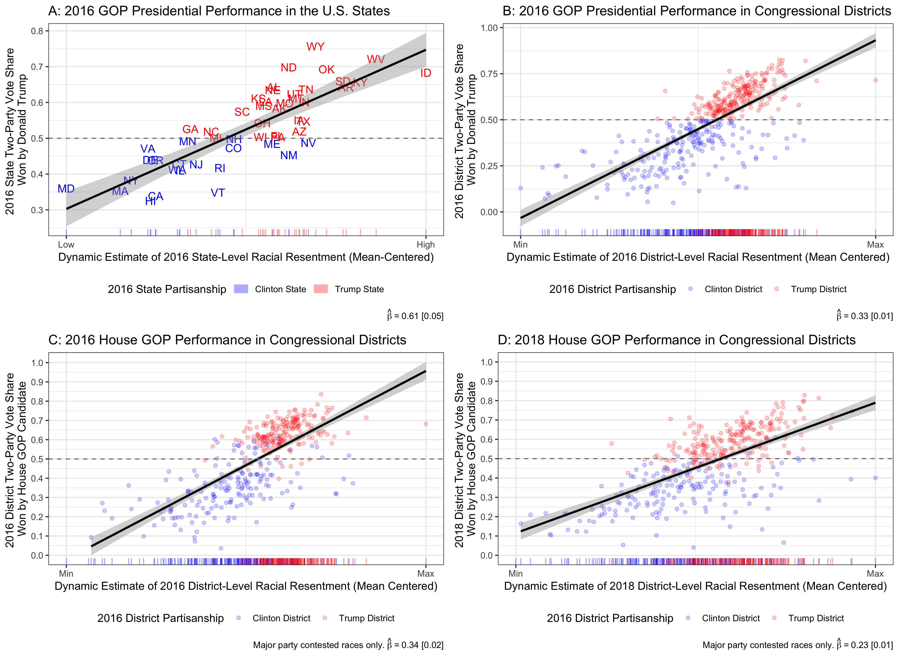

<head>
<title>Isaac Hale's Research</title>

<!-- Global site tag (gtag.js) - Google Analytics -->

</head>

<b>Published & Working Research Manuscripts</b>

<i>
Bivariate Relationship between Subnational Racial Resentment & GOP Vote Shares
</i>

  

<b>Racial attitudes & political cross-pressures in nationalized elections: The case of the Republican coalition in the Trump era   with <a href="https://calgara.github.io">Carlos Algara</a>, Assistant Professor of Political Science, Claremont Graduate University</b>

<i>
\(\star\) <a href="https://www.sciencedirect.com/science/article/pii/S0261379420300901">Manuscript Published in Electoral Studies (2020)</a> \(\star\)<a href="mailto:idhale@ucdavis.edu">Manuscript Data Materials</a>
</i>

<i>Abstract</i>: While scholars have found that Trump was able to capitalize on the racial attitudes of white voters, it is less clear how these racial attitudes influenced vote-choice across partisan and ideological cleavages in the electorate. It is also unclear whether racial attitudes affected voting at the congressional level or electoral outcomes at the aggregate level. Using a novel measure of racial attitudes at the subnational level and survey data, we make three clear findings: (1) Trump and Republican congressional candidates benefited from conservative racial attitudes both at the aggregate level and among white voters, (2) this electoral benefit for Republicans persisted during the 2018 midterm elections, and (3) the effect of attitudes on vote-choice did not significantly vary across partisan and ideological cleavages in the white electorate. Our findings suggest that, even during the era of highly nationalized and partisan elections, racial attitudes are still a mechanism by which Republicans can win significant electoral support among Democrats and relatively liberal voters in the white electorate. These findings have implications for the growing salience of race in the Republican electoral coalition.

 
 

<i>
Scatterplot of Re-scaled Bonica CFscores Against Shor-McCary NPAT Scores for State Legislators
</i>

  

<b>Candidate Extremism and Electoral Design in U.S. State Legislative Elections</b>

\(\star\)<i><a href="https://doi.org/10.1111/ssqu.12749">Manuscript Published in Social Science Quarterly (2019)</a> \(\star\)<a href="mailto:idhale@ucdavis.edu">Manuscript Data Materials</a>
</i>

<i>Abstract</i>: This study examines the effect of electoral system variation in U.S. state legislative elections on candidate ideological dispersion. Previous work suggests that, under certain conditions, greater district magnitude has a centrifugal polarizing effect on candidate ideology. Cross-national investigations of this theory by Ezrow (2008) and Dow (2001, 2011) have produced conflicting results. Building on this body of research, this paper leverages electoral system variation in U.S. state legislative elections to evaluate whether district-level electoral system variation influences candidate ideology. We find strong evidence for a polarizing effect of district magnitude on candidate ideology, even under plurality voting. This paper has significant implications for our understanding of candidate ideological positioning in sub-national contexts as well of how electoral systems affect the quality of representation voters receive from legislators.

 
 

<i>
Predicting Strategic Vote With Perceptions of Candidate Viability
</i>

<b>Abandon Ship? An Analysis of Strategic Voting among Liberal Democrat Voters in the 2015 UK Election</b>

\(\star\)<i><a href="https://academic.oup.com/pa/advance-article-abstract/doi/10.1093/pa/gsz007/5365507">Manuscript Published in Parliamentary Affairs (2019)</a> \(\star\)<a href="mailto:idhale@ucdavis.edu">Manuscript Data Materials</a>
</i>

<i>Abstract</i>: Strategic voting occurs when voters make vote choices using their ex ante expectations about the results of an election in addition to their sincere candidate preferences. While there is ample theoretical reason to believe strategic voting should occur under certain electoral conditions and institutional arrangements, the evidence for it in the literature has been mixed. I theorise that the polarisation of the two main British political parties and the highly publicised predictions of defeat for Britain's primary national third party, the Liberal Democrats, make the 2015 UK election an ideal case for studying strategic voting. I adapt established methods of identifying strategic voting to this election and find evidence that Liberal Democrat voters in the UK voted strategically for Labour and Conservative candidates to maximise their odds of affecting the electoral outcome in their constituency.

 
 

<i>
Probability of Democratic House Vote by Racial Resentment and Candidate Race Among Whites
</i>

  

<b>The Compound Effects of Candidate Race and Racial Resentment in US House Elections</b>

<i>
\(\star\)<a href="https://dx.doi.org/10.1017/rep.2019.34">Manuscript Published in The Journal of Race, Ethnicity, and Politics (2019)</a> \(\star\)<a href="mailto:idhale@ucdavis.edu">Manuscript Data Materials</a>
</i>

<i>Abstract</i>:  Despite the longstanding underrepresentation of blacks in Congress, political science research has not settled on the cause. While there is increasing evidence that racial attitudes affect vote choice in today's congressional elections, how this effect interacts with the race of the candidates is unknown. This study addresses this debate by analyzing novel survey, census, and candidate data from the Obama era of congressional elections (2010-2016) in order to test whether racially prejudiced attitudes held by whites decrease their likelihood of supporting black Democratic candidates and Democratic candidates as a whole. In line with theoretical predictions, this paper finds that Democratic House candidates are less likely to receive votes among white voters with strong racial resentment towards blacks, and black Democratic candidates fare even worse. These findings provide an explanation for black legislative underrepresentation and contribute to theories of partisan racial realignment.

 
 

<i>
Distribution of 2016 Federal Election Candidate Positions
</i>

  

<b>The Distorting Effects of Racial Animus on Proximity Voting in the 2016 Elections   with <a href="https://calgara.github.io">Carlos Algara</a>, Assistant Professor of Political Science, Claremont Graduate University</b>

<i>
\(\star\)<a href="https://journals.sagepub.com/doi/10.1177/1532673X18812403">Manuscript Published in Electoral Studies (2019)</a> \(\star\)<a href="mailto:idhale@ucdavis.edu">Manuscript Data Materials</a>

</i>
 
<i>Abstract</i>: While the use of racial appeals by the 2016 Trump campaign is indisputable, researchers are actively debating their precise role in influencing voter behavior in the election. We seek to expand upon existing research which finds that racial animus electorally benefited the Trump campaign. We examine to what extent those benefits redounded to GOP candidates down-ballot and whether racial animus distorted ideological proximity voting in the 2016 election. We find that racial animus among voters helped Republicans at multiple ballot levels and that higher levels of racial animus distorted correct proximity voting among voters ideologically closest to the Democratic candidate. Our findings suggest that high salience campaign appeals on race at the presidential level can influence elections for the House and Senate. We also provide evidence that the process of racial partisan realignment is incomplete, as some white voters still vote incongruously with their ideology due to racial animus.

 
 
<i>
California Top-2 Election Competitiveness by Party Registration and Election Type
</i>

<b>Some General Consequences of California's Top-Two Primary System   with <a href="https://ps.ucdavis.edu/people/bhighton">Benjamin Highton</a>, Professor of Political Science, University of California, Davis &    <a href="https://ps.ucdavis.edu/people/huckfeld">Robert Huckfeldt</a>, Distinguished Professor of Political Science, University of California, Davis </b>

<i>
\(\star\)<a href="https://escholarship.org/uc/item/5zt6b4r1">Manuscript Published in the California Journal of Politics and Policy (2016)</a> \(\star\)<a href="mailto:idhale@ucdavis.edu">Manuscript Data Materials</a>
</i>

<i>Abstract</i>: This paper analyzes some of the general election consequences of the top-two primary system in California elections beginning in 2012. In particular we focus on general election contests between candidates of the same party that were not possible under the previous primary system, but have occurred with some regularity with the top-two.We find that same party elections are characterized by greater competitiveness, lower turnout, and less, but still substantial, polarized voting.

 
 

<i>
The Chilean Party System in the Electorate, 1989-2017
</i>

<b>Electoral Reform & Strategic Voting in Chilean Legislative Elections</b>

<i>
\(\star\)<b>Invited to Revise & Resubmit</b>\(\star\)<a href="files/Chile_Strategic_Voting_(preview).pdf">Working Manuscript Draft</a> \(\star\)<a href="mailto:idhale@ucdavis.edu">Manuscript Data Materials</a>
</i>

</i>
 
<i>Abstract</i>: This paper examines the effects of Chile's 2015 electoral reform, which increased the magnitude of districts in Chile's lower legislative chamber from two to between three and eight. This increase in district magnitude allows for a convenient "natural experiment": post-reform voters should strategically vote at lower levels than pre-reform voters. I find strong evidence that voters have responded to Chile's electoral reform by engaging in less party-level strategic voting. However, I surprisingly find no evidence that the reform has decreased strategic voting for Chile's pre-electoral pacts. This study demonstrates that Chile's electoral reform is already affecting voter behavior and is doing so in line with theoretical expectations.

 
 

<i>
Strength of Partisanship in Direct-Elections for U.S. Senate, 1914-2020
</i>

<b>Do Voters Balance Partisan Control of the Federal Government During the Partisan Era? Assessing the Case of the 2021 Georgia U.S. Senate Runoffs  with <a href="https://calgara.github.io">Carlos Algara</a>, Assistant Professor of Political Science, Claremont Graduate University &    <a href="https://corystruthers.weebly.com/">Cory Struthers</a>, Assistant Professor of Public Administration and Policy, University of Georgia</b>

<i>
\(\star\)<b>Under Review</b>\(\star\)<a href="files/GA_Runoffs_(preview).pdf">Working Manuscript Draft</a> \(\star\)<a href="mailto:idhale@ucdavis.edu">Manuscript Data Materials</a>
</i>

</i>
 
<i>Abstract</i>: Recent work on American presidential election cycles posits that voters engage in anticipatory balancing, with voters being more likely to vote against a legislative candidate if they believe the candidate’s party will win the presidency. This theory predicts split-ticket voting on the basis that voters prefer divided government to moderate collective policy outcomes by forcing agreement among  institutions controlled by opposing parties. We test this theory within the context of the 2021 Georgia U.S. Senate runoffs, which solely determined whether Democrats would have unified control of the federal government by determining majority control of the Senate. This context provides a crucial test of the theory by providing an environment of perfect information in which partisan control of the presidency and the House of Representatives is already determined and not conditional on standing election outcomes across states. Leveraging an original survey of Georgia voters, we find no evidence of balancing within the general electorate and among partisans across differing model specifications. We confirm this lack of balancing in qualitative content analysis of voter electoral runoff intentions. We reconcile this lack of evidence for balancing to original analysis showing the unprecedented partisan nature of contemporary Senate elections since direct-election began in 1914.

 
 

<i>
The Effect of Racial Resentment on Political Participation, by Party
</i>

<b>Race, Resentment & Democratic Politics: The Role of Racial Resentment in Motivating Electoral Participation  with <a href="https://calgara.github.io">Carlos Algara</a>, Assistant Professor of Political Science, Claremont Graduate University</b>

<i>
\(\star\)<b>Working Paper</b>\(\star\)<a href="files/Resentment_Electoral_Participation (preview).pdf">Working Manuscript Draft</a> \(\star\)<a href="mailto:idhale@ucdavis.edu">Manuscript Data Materials</a>
</i>

</i>
 
<i>Abstract</i>: While scholarly attention has focused on the role racial resentment plays in shaping political preferences, relatively little is known how racial resentment influences the propensity of citizens to participate in politics. In this paper, we present a model positing that racial resentment motivates the degree to which white Americans participate in the political process. Using a novel measure of racial resentment at the subnational level and survey data, we make three clear findings: (1) racial resentment is associated with higher observed turnout at the congressional district and state level, (2) latent racial resentment also motivates the propensity of individual white voters to turnout to vote, and (3) latent racial resentment also motivates more sophisticated forms of political participation, such as campaign involvement. By contrast, we find no evidence that racial resentment motivates non-white Americans to participate in democratic politics. These findings compliment standing work finding that racial resentment serves as a powerful predictor of electoral choice among whites, to the benefit of Republican candidates. These findings have implications for the potency of racial resentment as a motivating factor in the electoral calculus of white Americans.

 
 
