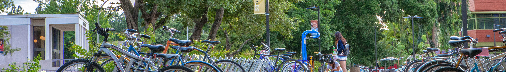

<head>

<!-- Global site tag (gtag.js) - Google Analytics -->

</head>

 
In my years as a graduate and undergraduate student, I benefited from teachers whose pedagogical ingenuity and intellectual curiosity pushed me to excel. As an assistant professor, lecturer, and associate instructor, I have sought to similarly inspire undergraduate students to realize their full academic potential. At Occidental College and UC Davis, I have had the privilege to teach undergraduate courses in American politics, comparative politics, and research methods as the instructor of record. In 2019, I was honored to receive the Marvin Zetterbaum Award for Excellence in Graduate Student Instruction from the UC Davis Department of Political Science.

Below you will find links containing syllabi, sample classroom presentations, and sample code for courses I have instructed.  

# Assistant Professor (Occidental College)

<ol>

 <li> American Politics and Public Policy (Fall 2022) 
 <ul>
   <li><a href="syllabi/oxy/POLS_101_F2022_final.pdf">Syllabus</a></li>
 
 </ul></li>

 <li> Research Methods in Politics and Public Policy (Fall 2022) 
 <ul>
   <li><a href="syllabi/oxy/POLS_300_F2022_final.pdf">Syllabus</a></li>
  
 </ul></li>
 
 
# Lecturer (UC Davis)

<ol>

 <li> Electoral Systems (Spring 2021) 
 <ul>
   <li><a href="syllabi/POL_140A_2021.pdf">Syllabus</a></li>
   <li><a href="presentations/POL 140A - Proportional Representation (Spring 2021).pdf">Sample Classroom Presentation</a></li>
   <li><i>Course delivered online due to COVID-19</i></li>
    
 </ul></li>

  <li> Introduction to Comparative Politics (Spring 2021) 
  <ul>
  <li><a href="syllabi/POL_002_2021_Spring.pdf">Syllabus</a></li>
  <li><a href="presentations/POL 002 - Presidentialism and Parliamentarism 1 (Spring 2021).pdf">Sample Classroom Presentation</a></li>
  <li><i>Course delivered online due to COVID-19</i></li>
   
  </ul></li>

 <li>The Legislative Process (Winter 2021) 
 <ul>
   <li><a href="syllabi/pol_105_2021_Winter.pdf">Syllabus</a></li>
   <li><a href="presentations/POL 105 - The Electoral Connection (Winter 2021).pdf">Sample Classroom Presentation</a></li>
   <li><i>Course delivered online due to COVID-19</i></li>
    
 </ul></li>

  <li>The Presidency (Winter 2021) 
  <ul>
  <li><a href="syllabi/pol_106_2021_Winter.pdf">Syllabus</a></li>
  <li><a href="presentations/POL 106 - The Invisible Primary (Winter 2021).pdf">Sample Classroom Presentation</a></li>
  <li><i>Course delivered online due to COVID-19</i></li>
   
  </ul></li>

 <li>The 2020 Election: America Decides (Fall 2020) 
 <ul>
   <li><a href="syllabi/pol_11A_2020.pdf">Syllabus</a></li>
    <li><a href="presentations/POL 11A - Election Preview (Fall 2020).pdf">Sample Classroom Presentation</a></li>
   <li><i>Course delivered online due to COVID-19</i></li>
    
 </ul></li>

 <li>Introduction to Comparative Politics (Fall 2020) 
 <ul>
   <li><a href="syllabi/pol_002_2020.pdf">Syllabus</a></li>
   <li><a href="presentations/POL 2 - Chile Country Case (Fall 2020).pdf">Sample Classroom Presentation</a></li>
   <li><i>Course delivered online due to COVID-19</i></li>
    
 </ul></li>

 <li>The Legislative Process (Summer 2020) 
 <ul>
   <li><a href="syllabi/pol_105_2020_SS2.pdf">Syllabus</a></li>
   <li><a href="presentations/POL105 - Is Congress Broken (Summer 2020).pdf">Sample Classroom Presentation</a></li>
   <li><i>Course delivered online due to COVID-19</i></li>
    
 </ul></li>

  <li>The Presidency (Summer 2020) 
  <ul>
  <li><a href="syllabi/pol_106_2020_SS1.pdf">Syllabus</a></li>
  <li><a href="presentations/POL 106 - Rethinking Electoral Institutions.pdf">Sample Classroom Presentation</a></li>
  <li><i>Course delivered online due to COVID-19</i></li>
   
  </ul></li>

</ol>

# Associate Instructor of Record (UC Davis)

<ol>
  <li>The Presidency (Spring 2020) 
  <ul>
  <li><a href="syllabi/pol_106_2020_Spring.pdf">Syllabus</a></li>
  <li><a href="presentations/POL 106 - The Presidential Election 1.pdf">Sample Classroom Presentation</a></li>
  <li><i>Course delivered online due to COVID-19</i></li>
   
  </ul></li>

  <li>The Legislative Process (Winter 2019) 
  <ul>
  <li><a href="syllabi/pol_105_2019.pdf">Syllabus</a></li>
  <li><a href="presentations/Congress & The Courts.pdf">Sample Classroom Presentation</a></li>
   
  </ul></li>
 
  <li>Introduction to Comparative Politics (Summer 2018)
  <ul>
  <li><a href="syllabi/pol_002_2018.pdf">Syllabus</a></li>
  <li><a href="presentations/Country Cases - Canada + UK + NZ.pdf">Sample Classroom Presentation</li></a>
   
  </ul></li>
  
  <li>Introduction to American Politics (Winter 2018)
  <ul>
  <li><a href="syllabi/pol_001_2018.pdf">Syllabus</a></li>
  <li><a href="presentations/Party Polarization.pdf">Sample Classroom Presentation</li></a>
   
  </ul></li>
  
  <li>Introduction to American Politics (Fall 2017)
  <ul>
  <li><a href="syllabi/pol_001_2017.pdf">Syllabus</a></li>
  <li><a href="presentations/Elections + Voting Choice.pdf">Sample Classroom Presentation</li></a>
   
  </ul></li>
  
  <li>Introduction to Comparative Politics (Summer 2017)
  <ul>
  <li><a href="syllabi/pol_002_2017.pdf">Syllabus</a></li>
  <li><a href="presentations/Electoral Systems I.pdf">Sample Classroom Presentation</li></a>
   
  </ul></li>
  
</ol>

# Discussion Section Teaching Assistant (UC Davis)
 <ol>
   <li>Eastern European Democratization (Winter 2020)
  <ul>
  <li><a href="syllabi/TA_pol_144A_2020.pdf">Syllabus (Josephine Andrews)</a></li>
  <li><a href="presentations/POL 144A Section 5 Slides.pdf">Sample Section Presentation</a></li>
   
  </ul></li>
 
  <li>The Scientific Study of Politics (Fall 2018)
  <ul>
  <li><a href="syllabi/TA_pol_051_2018.pdf">Syllabus (Bradford Jones)</a></li>
  <li><a href="code/Isaac Code - Week 4 Section.R">Sample Section R Code</a></li>
   
  </ul></li>

  <li>Introduction to American Politics (Spring 2018)
  <ul>
  <li><a href="syllabi/TA_pol_001_2018.pdf">Syllabus (Benjamin Highton)</a></li>
  <li><a href="presentations/Final Exam Review.pdf">Sample Section Presentation</a></li>
   
  </ul></li>
  
  <li>Problems in American Politics (Fall 2016)
  <ul>
  <li><a href="syllabi/TA_pol_005_2016.pdf">Syllabus (Amber Boydstun)</a></li>
  <li><a href="presentations/POL 005 2016 Post-Election Slides.pdf">Sample Section Presentation</a></li>
   
  </ul></li>
  
  <li>The American Presidency (Summer 2016)
  <ul>
  <li><a href="syllabi/TA_pol_106_2016.pdf">Syllabus (Amber Boydstun)</a></li>
  <li><a href="presentations/POL106 Journal Workshop 02 Slides.pdf">Sample Section Presentation</a></li>
   
  </ul></li>

  <li>The Scientific Study of Politics (Winter 2016)
  <ul>
  <li><a href="syllabi/TA_pol_051_2016.pdf">Syllabus (Bradford Jones)</a></li>
  <li><a href="code/Isaac Code - Week 9 Section.R">Sample Section R Code</a></li>
   
  </ul></li>
 
  
</ol>

# Teaching Assistant (UC Davis)
 <ol>
  <li>California State Government and Politics (Fall 2019)
  <ul>
  <li><a href="syllabi/TA_pol_104_2019.pdf">Syllabus (Scott MacKenzie)</a></li>
   
  </ul></li>

  <li>French Politics (Spring 2019)
  <ul>
  <li><a href="syllabi/TA_pol_147C_2019.pdf">Syllabus (James Adams)</a></li>
  <li><a href="presentations/EU Election Lecture (Hale).pdf">Guest Lecture Presentation</a></li>
   
  </ul></li>

  <li>Russian Politics (Spring 2017)
  <ul>
  <li><a href="syllabi/TA_pol_144B_2017.pdf">Syllabus (Josephine Andrews)</a></li>
   
  </ul></li>
  
  <li>Electoral Systems (Winter 2017)
  <ul>
  <li><a href="syllabi/TA_pol_140A_2017.pdf">Syllabus (Matthew Shugart)</a></li>
  <li><a href="presentations/Electoral Systems Guest Lecture.pdf">Guest Lecture Presentation</a></li>
   
  </ul></li>
  
  <li>Judicial Politics (Spring 2016)
  <ul>
  <li><a href="syllabi/TA_pol_150_2016.pdf">Syllabus (Jeremy Fortier)</a></li>
   
  </ul></li>
 
  <li>British Politics (Fall 2015)
  <ul>
  <li><a href="syllabi/TA_pol_147B_2015.pdf">Syllabus (James Adams)</a></li>
   
  </ul></li>
  
</ol>